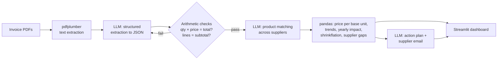

# 🛡️ MarginGuard

**Catch the supplier price rises that quietly eat a small restaurant's profit.**

MarginGuard reads a café or restaurant's supplier invoices, tracks the real price of every ingredient over time, and flags increases the owner never noticed — including *shrinkflation* (same price, smaller pack). It tells them what each increase costs per year and drafts the email to push back.

**Track:** AI + Business — ForgeHacks 2026

| | |
|---|---|
| 🎥 Demo video | _add YouTube link_ |
| 🌐 Live app | _add Streamlit link_ |

<!-- TODO: save a dashboard screenshot as docs/screenshot-dashboard.png, then delete this line and the two arrows around the next line -->
<!--  -->

---

## Problem and target users

Small independent restaurants run on razor-thin margins. Before the pandemic, food and labour each took about a third of every sales dollar at a typical independent restaurant, leaving a pre-tax profit of roughly **5%**. Since 2019, food costs have risen about **35%** ([National Restaurant Association](https://restaurant.org/research-and-media/research/restaurant-economic-insights/analysis-commentary/elevated-costs-continue-to-pressure-restaurant-profitability/)), and 42% of operators said they weren't profitable in 2025 ([Bar & Restaurant, reporting NRA data](https://www.barandrestaurant.com/operations/nra-rising-costs-continue-squeeze-restaurant-profitability)).

Price rises rarely arrive as one big announcement. They show up as a few cents more per line on paper invoices, or as a 10kg bag that quietly becomes 9kg. Owners are too busy to compare every invoice line by line, and different suppliers name the same product differently, so the increases go unnoticed. With a 5% margin, a few unnoticed 5–15% increases can wipe out a large share of the year's profit.

**Who it's for:** owners and managers of small independent cafés, restaurants, bakeries and food stalls who buy from several suppliers and don't have a finance team.

### How it answers the AI + Business prompt

The prompt asks for AI that *turns business data into clear insights, predictions, or recommendations that help people make better decisions*. MarginGuard takes the business data a restaurant already has (its supplier invoices) and turns it into:
- **Insights:** which ingredients got more expensive, by how much, since when, and which supplier is cheaper for the same item.
- **Recommendations:** what to do about each increase, plus a ready-to-send email to the supplier.
- **A decision-ready number:** the yearly cost of each increase, so the owner knows which one to deal with first.

## What it does

1. **Read** — Upload invoice PDFs in any layout. AI extracts every product, quantity, pack size and price.
2. **Match** — AI recognises the same product across suppliers ("EGGS LARGE TRAY/30" = "Eggs, large (tray of 30)"), renamed items, and new pack sizes.
3. **Measure** — Code calculates price per kg / litre / item over time and the yearly cost of every increase.
4. **Act** — AI writes a prioritised action plan and a ready-to-send negotiation email to the supplier.

On our 24 fictional sample invoices (3 suppliers, 6 months) it finds **$2,104/year** in hidden extra costs — **4.2% of the café's supplier spend** — plus $250/year it could save by buying eggs from the cheaper of its two suppliers.

## Technical approach



### Why this is more than an AI wrapper

- **AI does three distinct jobs**, each where it's genuinely better than rules: reading messy invoices in any layout, matching product names that no regex could reliably match, and turning numbers into practical advice.
- **AI output is verified, not trusted.** Every extraction is checked with arithmetic (quantity × unit price = line total; lines add up to the subtotal). If a check fails, the model is told exactly what was wrong and asked to correct itself; anything still wrong is shown to the user as a warning.
- **The AI never does maths.** All dollar figures are calculated deterministically in pandas, so the numbers are always correct and reproducible. The recommendation step references findings by ID and the app displays our calculated numbers, not the model's.
- **Price per base unit**, not per pack, is what makes shrinkflation visible.
- **Measured accuracy:** on the 24 sample invoices, the AI read **600/600 line-item numbers correctly (100%)** and all 48 invoice dates and numbers, with no self-corrections needed (run `python evaluate.py`). These are clean, computer-generated PDFs, so expect lower accuracy on real-world invoices.

## Technical components

- **Python**, **Streamlit** (UI + hosting on Streamlit Community Cloud), **pandas**, **Altair**
- **pdfplumber** for PDF text, **pydantic** for schema validation
- **LLM:** any OpenAI-compatible API; we use **Featherless AI** with an open-source model (`Qwen2.5-72B-Instruct`)
- **reportlab** to generate the sample invoices

## How to test it (for judges)

1. Open the live app (link at the top) or run it locally (below).
2. Leave **Use sample invoices** switched on and click **Analyze invoices**.
3. Compare the results with [`sample_invoices/PLANTED_CHANGES.md`](sample_invoices/PLANTED_CHANGES.md), which lists the price changes we deliberately hid in the sample invoices. The app should find all 7 and flag none of the stable items.
4. Open the **Extracted data** tab to see exactly what the AI read from each invoice, and **How the numbers work** for the formulas.

## Run it locally

Requires Python 3.11 or newer.

**Windows, the easy way:** double-click `setup_and_test.bat` once (installs everything and runs the test), add your API key with `check_ai.bat`, then double-click `run_app.bat`.

**Any system, from a terminal:**

```bash
git clone https://github.com/<your-username>/marginguard.git
cd marginguard
python -m venv .venv && source .venv/bin/activate   # Windows: .venv\Scripts\activate
pip install -r requirements.txt
cp .env.example .env        # Windows: copy .env.example .env   -- then put your API key in .env
streamlit run app.py
```

The sample invoices work without an API key because their AI results are cached in `cache/`. Your own invoices need a key.

Other commands:

```bash
python pipeline.py              # run the full pipeline in the terminal on the samples
python evaluate.py              # measure extraction accuracy against the known answers
python tests/test_pipeline.py   # offline test of validation, matching and maths (no API key)
python generate_samples.py      # regenerate the sample invoices
```

## Project structure

```
app.py               Streamlit dashboard
pipeline.py          Runs extract → normalize → analyze → recommend
extract.py           PDF → text → LLM → validated JSON (with self-correction)
normalize.py         LLM product matching across suppliers
analyze.py           Price maths, shrinkflation, supplier gaps (no AI)
recommend.py         LLM action plan + supplier email
llm.py               OpenAI-compatible client with on-disk cache
evaluate.py          Extraction accuracy vs ground truth
generate_samples.py  Creates the 24 fictional sample invoices
sample_invoices/     Sample PDFs, ground_truth.json, PLANTED_CHANGES.md
tests/               Offline end-to-end test with a fake LLM
*.bat                Windows double-click helpers (setup, AI check, run app)
```

## What works and what doesn't

**Works**
- Text-based PDF invoices in different layouts and date formats
- Product matching across suppliers, renamed items and changed pack sizes
- Price-increase, shrinkflation and cheaper-supplier detection with yearly cost
- Self-correcting extraction with arithmetic checks
- AI action plan and supplier email

**Not yet**
- Photos or scanned paper invoices (would need OCR or a vision model)
- Connecting directly to accounting software (e.g. Xero) or email inboxes
- Not yet tested on real supplier invoices: all results above come from our 24 synthetic sample invoices
- Multi-page invoices are supported by the code but not tested
- Price history starts from the first invoice uploaded, so it can't see increases that happened before then
<!-- TODO: update this list honestly before submitting -->

## Real-world impact

**For the business:** in our sample café, which spends about $4,200 a month on supplies, MarginGuard surfaced about $2,100 a year in increases. That matters when a typical restaurant keeps only about 5% of sales as profit. It also gives the owner evidence and a drafted email to negotiate with, something they rarely have time to prepare.

**For the wider economy:** independent restaurants are a major source of local jobs, and many are struggling with rising costs. A free tool that protects their margins helps them stay open. The same approach works for any small business that buys from suppliers, such as retail shops, salons and workshops.

*These figures come from fictional sample data, so treat them as an illustration of what the tool finds, not a measured result for real businesses.*

## Built during ForgeHacks 2026

Built from scratch between October 3–10, 2026 by _[Name 1]_ and _[Name 2]_. <!-- TODO: your names -->

**AI use, honestly:** besides the LLM inside the product, we used Claude (an AI assistant) to help plan the project and write parts of the code, sample data and documentation. We reviewed, ran and tested everything ourselves. All sample invoices and businesses are fictional.
